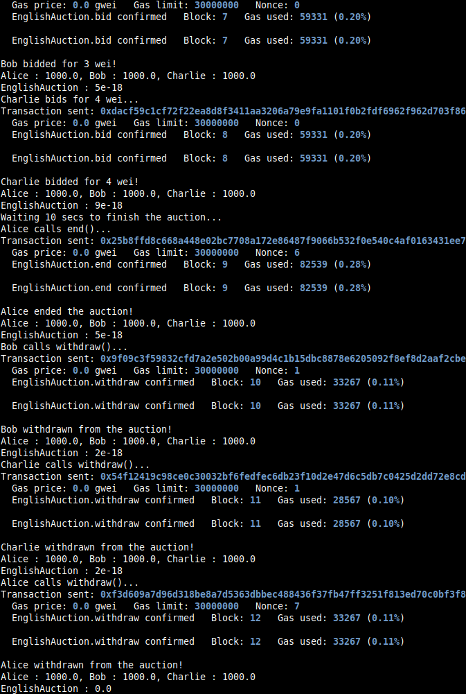
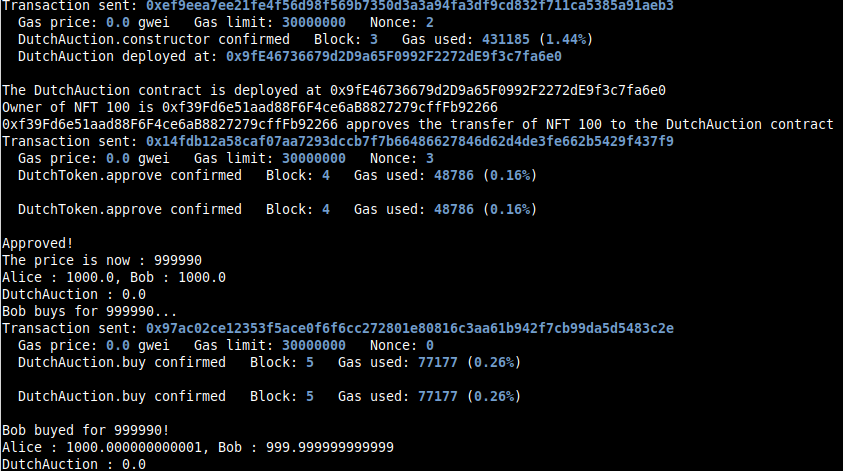
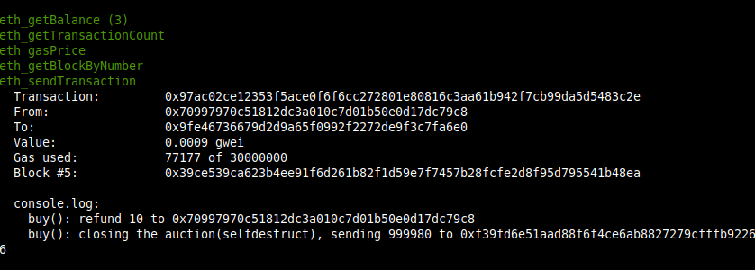

Study case of the English and Dutch Auction contracts, from [Solidity by Example Site, English Auction and Dutch Auction ](https://solidity-by-example.org/app/dutch-auction/)

I use brownie to compile and deploy into hardhat in order to have the console.log feature.
You should start the hardhat node in another terminal and folder (`hh node`), then, in a terminal :

```bash
brownie compile
brownie run scripts/deploy.py
```

English Auction, after deploying from brownie :


Dutch Auction, after deploying from brownie :


The result in the hardhat console :

